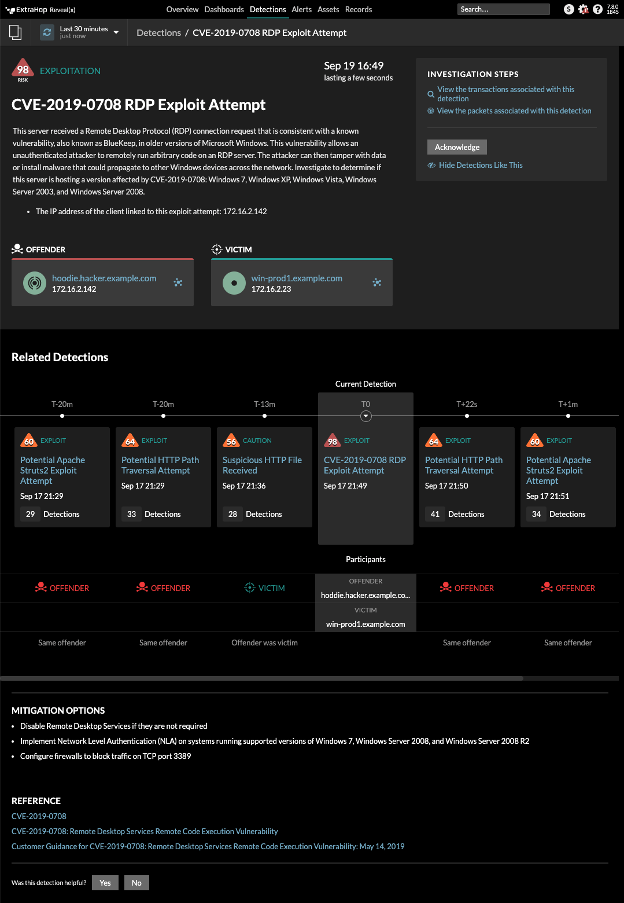
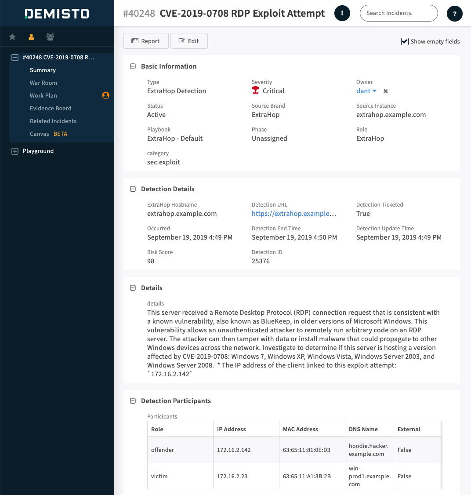
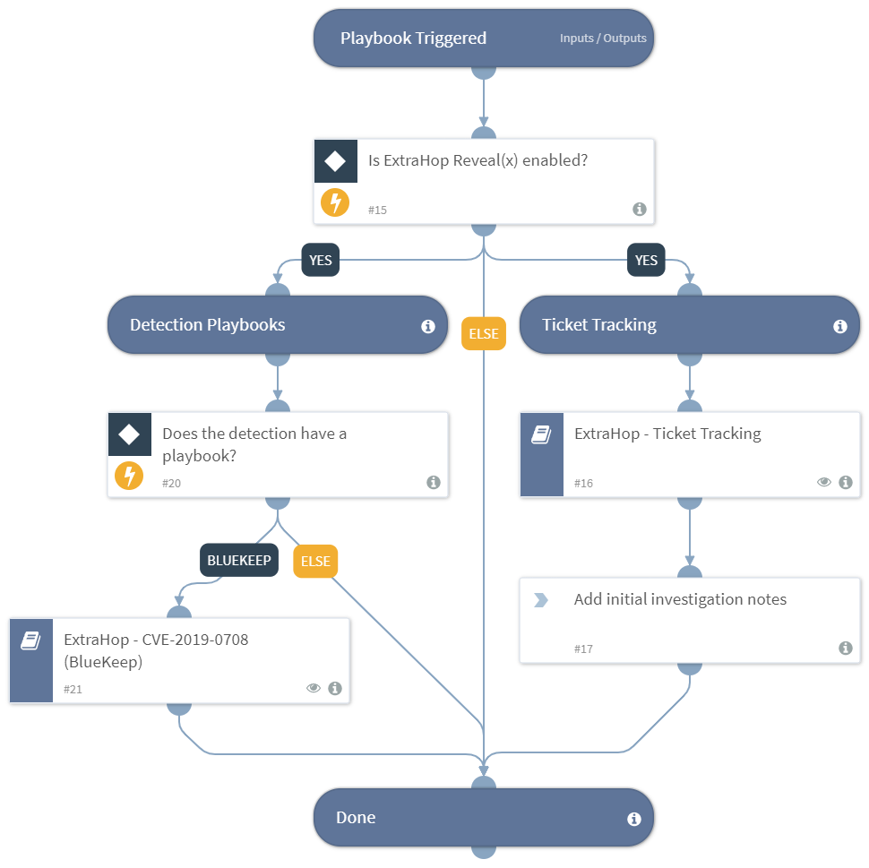
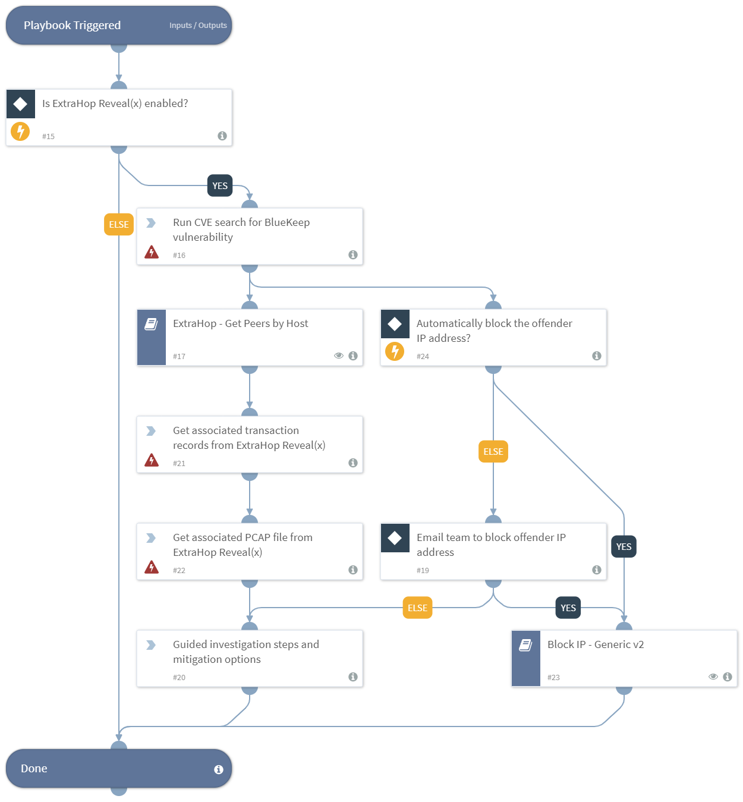

Network detection and response. Complete visibility of network communications at enterprise scale, real-time threat detections backed by machine learning, and guided investigation workflows that simplify response.

##### What does this pack do?
This integration enables the following investigative tasks and workflows in Cortex XSOAR as an automated response to ExtraHop Reveal(x) detections:

- Create a Cortex XSOAR incident in real-time when a Reveal(x) detection identifies malicious or non-compliant behavior on your network.
- Leverage Reveal(x) playbooks to respond with thousands of security actions that accelerate automated investigation and remediation.
- Send real-time queries to Reveal(x) through the ExtraHop REST API that enable you to search for specific devices, network peers, active protocols, records, and packets that are part of your investigation.
- Track tickets in Reveal(x) that link detections to your Cortex XSOAR investigation.

The bundle for this integration includes a single trigger that formats Reveal(x) detections and sends a request to create Cortex XSOAR incidents through the Cortex XSOAR REST API. After an incident is created in Cortex XSOAR, the default ExtraHop playbook assigns an ExtraHop analyst role to the incident, sets up ticket tracking, and runs associated detection playbooks.

**Note:** Incidents are pushed in via the Cortex XSOAR REST API by a trigger running on the ExtraHop Reveal(x) appliance, the Fetch Incidents command is not used.

_For more information, visit our [Cortex XSOAR Developer Docs](https://xsoar.pan.dev/docs/reference/integrations/extra-hop-v2) and the [ExtraHop Installation Guide](https://www.extrahop.com/customers/community/bundles/extrahop/demisto-integration/)._

The following figures show an example of a Reveal(x) detection and the resulting incident and workflows in Cortex XSOAR.

*Figure 1. Reveal(x) detection card for CVE-2019-0708 RDP Exploit Attempt*

*Figure 2. Cortex XSOAR incident summary for CVE-2019-0708 RDP Exploit Attempt*

*Figure 3. Reveal(x) Default playbook to set up ticket tracking and run the BlueKeep playbook*

*Figure 4. Reveal(x) CVE-2019-0708 BlueKeep playbook to automate detailed network investigation*